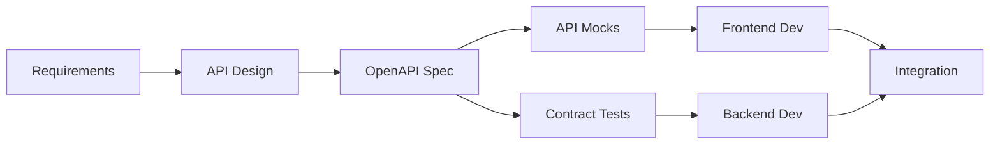

# Complete B2B SaaS Template: API-First, Test-Driven Development Guide

Based on comprehensive research across design, development, backend architecture, authentication, compliance, and workflow practices, this guide provides a complete blueprint for building a best-in-class B2B SaaS template in 2024-2025, with emphasis on **API-First architecture** and **Test-Driven Development (TDD)**.

## Executive Summary

This comprehensive implementation guide synthesizes current best practices across all aspects of B2B SaaS development. The recommended stack centers on **React + Next.js + TypeScript** for frontend, **Supabase** for backend, **Clerk** for authentication, with comprehensive **GDPR compliance** and modern **development workflows**. 

**Key Features Included:**
- **API-First Architecture**: OpenAPI specification, versioning, documentation-driven development
- **Test-Driven Development**: Red-Green-Refactor cycle, comprehensive test coverage
- **Complete GDPR Compliance**: User data export, account deletion, cookie consent, audit logging
- **Secure Authentication**: Forgot password flow, password reset with secure tokens, rate limiting
- **Multi-tenant Architecture**: Organization management, role-based access control
- **Real-time Features**: Live updates, collaborative features
- **Performance Optimized**: Core Web Vitals compliance, lazy loading, caching strategies
- **Enterprise Security**: SOC 2 ready, encryption at rest/transit, comprehensive audit trails

Key findings indicate significant shifts toward API-first methodologies, test-driven practices, and privacy-first architectures.

## Part 0: API-First Development Methodology

### Why API-First for B2B SaaS

API-first development prioritizes designing and building APIs before implementation, treating them as the primary building blocks of software. This approach is particularly valuable for B2B SaaS because:

- **Integration-Ready**: B2B customers expect seamless integrations with their existing tools
- **Parallel Development**: Frontend and backend teams can work simultaneously using API mocks
- **Consistency**: Enforced API standards across all services
- **Documentation-Driven**: Clear contracts before implementation reduces miscommunication
- **Scalability**: Modular architecture allows independent scaling of services

### API Specification & Design

**1. OpenAPI Specification (OAS 3.1)**

```yaml
openapi: 3.1.0
info:
  title: B2B SaaS API
  version: 1.0.0
  description: Complete API specification for our B2B SaaS platform
  
servers:
  - url: https://api.example.com/v1
    description: Production server
  - url: https://staging-api.example.com/v1
    description: Staging server

components:
  securitySchemes:
    bearerAuth:
      type: http
      scheme: bearer
      bearerFormat: JWT
    
  schemas:
    Error:
      type: object
      properties:
        code:
          type: string
          example: "INVALID_REQUEST"
        message:
          type: string
          example: "The request was invalid"
        details:
          type: object
          
    Organization:
      type: object
      required: [id, name, slug]
      properties:
        id:
          type: string
          format: uuid
        name:
          type: string
          minLength: 1
          maxLength: 255
        slug:
          type: string
          pattern: '^[a-z0-9-]+

### Design Philosophy for B2B SaaS 2024-2025

Modern B2B SaaS design has evolved from purely functional interfaces to **consumer-grade experiences while maintaining enterprise credibility**. The core philosophy emphasizes speed over complexity, reducing time-to-value, and emotional engagement alongside functionality.

### Color System and Typography

**Primary Color Palette:**
- **Trust & Reliability**: Blues (#2563EB, #1E40AF, #3B82F6)  
- **Growth & Innovation**: Greens (#10B981, #059669, #34D399)
- **Premium & Sophistication**: Purples (#8B5CF6, #7C3AED, #A78BFA)

**Functional Color System:**
- Success: Green (#10B981)
- Error: Red (#EF4444) 
- Warning: Yellow (#F59E0B)
- Information: Blue (#3B82F6)

**Typography Hierarchy:**
- **Primary Font**: Inter (modern, highly legible)
- **H1**: 48px desktop / 36px mobile
- **H2**: 36px desktop / 28px mobile  
- **H3**: 24px desktop / 20px mobile
- **Body**: 16px desktop / 14px mobile

### High-Converting Landing Page Patterns

**Hero Section Requirements:**
- Value proposition visible above-fold
- Contrasting CTA colors repeated 2-3 times
- Customer logos immediately visible for social proof
- **Trust signals**: Security badges, customer count statistics

**Information Architecture:**
- Inverted pyramid: Benefits first, technical details lower
- Scannable format with bullet points and visual hierarchy
- Progressive disclosure for detailed specifications

### Dashboard and Application UI Standards

**Navigation Patterns:**
- Persistent sidebar with always-accessible main functions
- Breadcrumb system for location awareness
- Global search with smart filters

**Data Visualization:**
- Match chart types to data types appropriately
- Maintain brand colors in visualizations
- Interactive elements: hover states, clickable legends

**Form Design Optimization:**
- Multi-step progression for complex forms
- Inline validation with real-time feedback
- Smart defaults and pre-populated data

## Part II: Frontend Development Standards

### Recommended Technology Stack

**Core Framework**: React 18+ with Next.js 14+
- **Why**: 39.5% developer usage, largest ecosystem, excellent performance with SSR/SSG
- **Alternative**: Vue.js for gentler learning curve, Angular for large enterprise teams

**State Management**: Zustand (primary recommendation)
- **85% less boilerplate** than Redux
- **<1KB gzipped** bundle size
- **Excellent TypeScript** support out of the box
- **When to use Redux Toolkit**: Large enterprise apps with complex state interactions

**Testing Framework**: Vitest + React Testing Library + Playwright
- **Vitest**: 10x faster than Jest, native ESM support
- **Playwright**: Better cross-browser support than Cypress

### Component Architecture

**File Structure Pattern:**
```
src/
├── components/
│   ├── atoms/          # Basic UI elements
│   ├── molecules/      # Simple compound components
│   ├── organisms/      # Complex UI sections
│   └── templates/      # Page-level layouts
├── features/           # Business logic modules
│   ├── auth/
│   ├── dashboard/
│   └── settings/
└── shared/            # Cross-cutting concerns
    ├── hooks/
    ├── utils/
    └── types/
```

**Design System Integration:**
- **Recommended**: Chakra UI for TypeScript support and accessibility
- **Alternative**: Material-UI for enterprise adoption, Tailwind UI for customization

### Performance Optimization Requirements

**Core Web Vitals Targets:**
- **Largest Contentful Paint (LCP)**: <2.5s
- **Interaction to Next Paint (INP)**: <200ms (new 2024 metric)
- **Cumulative Layout Shift (CLS)**: <0.1

**Implementation Strategies:**
- Next.js automatic code splitting
- Dynamic imports for heavy components
- Image optimization with Next.js Image component
- Progressive loading for dashboard widgets

### Accessibility Standards (WCAG 2.2)

**Critical Requirements:**
- Semantic HTML foundation with proper ARIA labels
- Focus management for modals and complex interactions
- Color contrast ratios meeting AA standards
- Keyboard navigation support for all interactive elements

**Testing Integration:**
- @axe-core/react for automated accessibility testing
- Manual testing with screen readers
- Pa11y for WCAG compliance verification

## Part III: Supabase Backend Architecture

### Multi-Tenant Database Design

**Recommended Pattern**: Shared Database with Tenant ID

```sql
-- Core tenant structure
CREATE TABLE tenants (
  id UUID PRIMARY KEY DEFAULT gen_random_uuid(),
  name TEXT NOT NULL,
  subdomain TEXT UNIQUE,
  created_at TIMESTAMP WITH TIME ZONE DEFAULT NOW(),
  settings JSONB DEFAULT '{}'::jsonb,
  subscription_status TEXT DEFAULT 'active'
);

-- Multi-tenant tables with tenant isolation
CREATE TABLE organizations (
  id UUID PRIMARY KEY DEFAULT gen_random_uuid(),
  tenant_id UUID REFERENCES tenants(id) ON DELETE CASCADE,
  name TEXT NOT NULL,
  created_at TIMESTAMP WITH TIME ZONE DEFAULT NOW()
);

-- Critical indexes for performance
CREATE INDEX idx_projects_tenant_id ON projects(tenant_id);
CREATE INDEX idx_profiles_tenant_user ON profiles(tenant_id, id);
```

### Row Level Security (RLS) Implementation

**Helper Function for Tenant Context:**
```sql
CREATE OR REPLACE FUNCTION auth.tenant_id()
RETURNS UUID
LANGUAGE SQL STABLE
AS $$
  SELECT NULLIF(
    ((current_setting('request.jwt.claims')::jsonb -> 'app_metadata')::jsonb ->> 'tenant_id'),
    ''
  )::UUID
$$;
```

**Core RLS Policies:**
```sql
-- Basic tenant isolation
CREATE POLICY "tenant_isolation_select" ON projects
  FOR SELECT TO authenticated
  USING (tenant_id = auth.tenant_id());

-- Role-based access within tenants
CREATE POLICY "admin_full_access" ON projects
  FOR ALL TO authenticated
  USING (
    tenant_id = auth.tenant_id() AND
    EXISTS (
      SELECT 1 FROM profiles 
      WHERE profiles.id = auth.uid() 
      AND profiles.tenant_id = auth.tenant_id()
      AND profiles.role IN ('admin', 'owner')
    )
  );
```

### Real-Time Features Configuration

**Optimized Subscription Pattern:**
```javascript
const subscription = supabase
  .channel(`tenant:${tenantId}`)
  .on('postgres_changes', {
    event: '*',
    schema: 'public',
    table: 'projects',
    filter: `tenant_id=eq.${tenantId}`
  }, handleProjectChanges)
  .subscribe()
```

### Vector Database for AI Features

**Semantic Search Setup:**
```sql
-- Enable pgvector extension
CREATE EXTENSION IF NOT EXISTS vector WITH SCHEMA extensions;

-- Documents table with embeddings
CREATE TABLE documents (
  id UUID PRIMARY KEY DEFAULT gen_random_uuid(),
  tenant_id UUID REFERENCES tenants(id) ON DELETE CASCADE,
  title TEXT NOT NULL,
  content TEXT NOT NULL,
  embedding vector(1536), -- OpenAI ada-002 dimension
  metadata JSONB DEFAULT '{}'::jsonb,
  created_at TIMESTAMP WITH TIME ZONE DEFAULT NOW()
);

-- Optimized vector index
CREATE INDEX documents_embedding_idx ON documents 
USING ivfflat (embedding vector_cosine_ops)
WITH (lists = 100);
```

### File Storage Security Patterns

**Multi-Tenant Storage with RLS:**
```sql
-- Tenant isolation for uploads
CREATE POLICY "tenant_upload_policy" ON storage.objects
  FOR INSERT TO authenticated
  WITH CHECK (
    bucket_id = 'documents' AND
    (storage.foldername(name))[1] = (
      SELECT tenant_id::text 
      FROM profiles 
      WHERE id = auth.uid()
    )
  );
```

## Part IV: Clerk Authentication Integration

### Integration Architecture

**Recommended Pattern**: Native Clerk + Supabase Integration
- Replace deprecated JWT template approach
- Use Clerk's official Supabase integration for better security
- Implement hybrid session architecture with 60-second JWT tokens

### Multi-Tenant Organization Schema

```sql
-- Organizations table
CREATE TABLE organizations (
  id UUID PRIMARY KEY DEFAULT gen_random_uuid(),
  clerk_org_id TEXT UNIQUE NOT NULL,
  name TEXT NOT NULL,
  slug TEXT UNIQUE NOT NULL,
  settings JSONB DEFAULT '{}'::jsonb,
  created_at TIMESTAMP WITH TIME ZONE DEFAULT NOW()
);

-- Organization memberships
CREATE TABLE organization_memberships (
  id UUID PRIMARY KEY DEFAULT gen_random_uuid(),
  organization_id UUID REFERENCES organizations(id) ON DELETE CASCADE,
  user_id UUID REFERENCES profiles(id) ON DELETE CASCADE,
  role TEXT NOT NULL DEFAULT 'member',
  invited_by UUID REFERENCES profiles(id),
  joined_at TIMESTAMP WITH TIME ZONE DEFAULT NOW(),
  UNIQUE(organization_id, user_id)
);
```

### Single Sign-On (SSO) Implementation

**Enterprise SSO Configuration:**
- **SAML 2.0**: Azure AD, Google Workspace, Okta
- **OIDC**: Custom identity providers
- **SCIM**: Automated user provisioning
- **Organization-level**: SSO per organization, not globally

### Role-Based Access Control (RBAC)

**Custom Permissions System:**
```sql
-- Roles and permissions
CREATE TABLE roles (
  id UUID PRIMARY KEY DEFAULT gen_random_uuid(),
  name TEXT NOT NULL,
  description TEXT,
  organization_id UUID REFERENCES organizations(id)
);

CREATE TABLE permissions (
  id UUID PRIMARY KEY DEFAULT gen_random_uuid(),
  name TEXT NOT NULL,
  resource TEXT NOT NULL,
  action TEXT NOT NULL
);

CREATE TABLE role_permissions (
  role_id UUID REFERENCES roles(id) ON DELETE CASCADE,
  permission_id UUID REFERENCES permissions(id) ON DELETE CASCADE,
  PRIMARY KEY (role_id, permission_id)
);
```

### Session Management Best Practices

**Security Headers Implementation:**
```javascript
// Security middleware
app.use((req, res, next) => {
  res.setHeader('Strict-Transport-Security', 'max-age=31536000; includeSubDomains');
  res.setHeader('X-Frame-Options', 'DENY');
  res.setHeader('X-Content-Type-Options', 'nosniff');
  res.setHeader('Referrer-Policy', 'strict-origin-when-cross-origin');
  res.setHeader('Content-Security-Policy', "default-src 'self'");
  next();
});
```

## Part V: GDPR Compliance Framework

### Technical Requirements Implementation

**Privacy by Design Architecture:**
```javascript
const privacyConfig = {
  dataMinimization: {
    enabled: true,
    maxRetentionDays: 365,
    autoDeleteEnabled: true
  },
  encryption: {
    atRest: 'AES-256',
    inTransit: 'TLS 1.3',
    keyRotation: 90 // days
  },
  auditLogging: {
    enabled: true,
    retentionDays: 2555, // 7 years
    includePII: false
  }
};
```

### Cookie Consent Management

**Complete Implementation:**
```javascript
class CookieConsentManager {
  constructor() {
    this.consentData = this.loadConsent();
    this.initializeBanner();
  }
  
  acceptAll() {
    const consent = {
      necessary: true,
      analytics: true,
      marketing: true,
      timestamp: new Date().toISOString(),
      version: '1.0'
    };
    this.saveConsent(consent);
    this.applyConsent();
  }
  
  async logConsent(consent) {
    await fetch('/api/consent-log', {
      method: 'POST',
      headers: { 'Content-Type': 'application/json' },
      body: JSON.stringify({
        consent,
        userAgent: navigator.userAgent,
        ip: await this.getClientIP()
      })
    });
  }
}
```

### Data Subject Rights Implementation

**Data Export Service:**
```python
class DataExportService:
    def export_user_data(self, user_id, format='json'):
        """Export all user data in structured format"""
        user_data = {
            'personal_info': self._get_personal_info(user_id),
            'account_data': self._get_account_data(user_id),
            'activity_logs': self._get_activity_logs(user_id),
            'preferences': self._get_preferences(user_id),
            'export_metadata': {
                'exported_at': datetime.utcnow().isoformat(),
                'format': format,
                'version': '1.0'
            }
        }
        
        return json.dumps(user_data, indent=2) if format == 'json' else self._export_as_csv(user_data)
```

### Audit Logging System

**Comprehensive Audit Schema:**
```sql
CREATE TABLE audit.processing_logs (
  log_id UUID PRIMARY KEY DEFAULT gen_random_uuid(),
  event_type VARCHAR(50) NOT NULL,
  user_id_hash VARCHAR(64), -- Hashed for privacy
  data_subject_hash VARCHAR(64),
  processing_purpose VARCHAR(100),
  legal_basis VARCHAR(50),
  data_categories TEXT[],
  timestamp TIMESTAMP DEFAULT NOW(),
  ip_address INET,
  metadata JSONB
);
```

## Part VI: Development Workflow & Architecture

### API-First Development Process

**1. Design-First Workflow**


**2. API Governance & Standards**
```typescript
// api/standards/validation.ts
export const APIStandards = {
  naming: {
    resources: 'plural-kebab-case', // /organizations, /user-profiles
    parameters: 'snake_case',       // created_at, user_id
    responses: 'camelCase'          // createdAt, userId
  },
  
  versioning: {
    strategy: 'url-path',           // /v1, /v2
    deprecation: '6 months',
    sunset: '12 months'
  },
  
  pagination: {
    style: 'cursor-based',
    params: ['cursor', 'limit'],
    maxLimit: 100
  },
  
  errors: {
    format: 'RFC7807',              // Problem Details
    codes: 'SCREAMING_SNAKE_CASE'   // VALIDATION_ERROR
  }
}
```

### Test-Driven Development Workflow

**1. TDD Cycle Implementation**
```typescript
// Example: Adding a new feature with TDD

// Step 1: RED - Write failing test
// __tests__/features/billing.test.ts
describe('Billing Service', () => {
  it('should calculate subscription cost with discount', () => {
    const billing = new BillingService()
    const cost = billing.calculateCost({
      plan: 'premium',
      seats: 10,
      discountCode: 'SAVE20'
    })
    
    expect(cost).toBe(720) // $90/seat * 10 * 0.8
  })
})

// Step 2: GREEN - Minimal implementation
// services/billing.ts
export class BillingService {
  calculateCost({ plan, seats, discountCode }) {
    const prices = { premium: 90 }
    const discounts = { SAVE20: 0.8 }
    
    return prices[plan] * seats * (discounts[discountCode] || 1)
  }
}

// Step 3: REFACTOR - Improve design
// services/billing.ts (refactored)
export class BillingService {
  constructor(
    private pricing: PricingStrategy,
    private discounts: DiscountRepository
  ) {}
  
  async calculateCost({ plan, seats, discountCode }) {
    const basePrice = await this.pricing.getPrice(plan)
    const discount = await this.discounts.getDiscount(discountCode)
    
    return basePrice * seats * discount.multiplier
  }
}
```

**2. Testing Strategy by Layer**

```typescript
// Unit Tests - Domain Logic
describe('OrganizationService', () => {
  it('should validate organization slug format', () => {
    expect(isValidSlug('my-company')).toBe(true)
    expect(isValidSlug('My Company')).toBe(false)
    expect(isValidSlug('my_company')).toBe(false)
  })
})

// Integration Tests - API Layer
describe('POST /api/v1/organizations', () => {
  it('should create organization with valid auth', async () => {
    const token = await getAuthToken()
    const response = await api
      .post('/organizations')
      .set('Authorization', `Bearer ${token}`)
      .send({ name: 'Test Org' })
      
    expect(response.status).toBe(201)
  })
})

// E2E Tests - User Flows
test('Complete onboarding flow', async ({ page }) => {
  await page.goto('/signup')
  await page.fill('[name="email"]', 'test@example.com')
  await page.fill('[name="password"]', 'SecurePass123!')
  await page.click('[type="submit"]')
  
  await expect(page).toHaveURL('/onboarding')
})
```

### Repository and CI/CD Strategy

**Monorepo Structure with API-First Organization**
```
saas-template/
├── api-spec/              # OpenAPI specifications
│   ├── v1/
│   │   └── openapi.yaml
│   └── v2/
│       └── openapi.yaml
├── apps/
│   ├── api/               # Backend API
│   │   ├── src/
│   │   └── __tests__/
│   ├── web/               # Frontend app
│   │   ├── src/
│   │   └── __tests__/
│   └── admin/             # Admin dashboard
├── packages/
│   ├── sdk/               # Generated API clients
│   ├── shared/            # Shared utilities
│   └── ui/                # UI component library
├── tests/
│   ├── integration/       # Cross-service tests
│   └── e2e/              # End-to-end tests
└── tools/
    ├── api-mock/          # Mock API server
    └── generators/        # Code generators
```

**CI/CD Pipeline with TDD Gates**
```yaml
# .github/workflows/main.yml
name: CI/CD Pipeline
on:
  push:
    branches: [main, develop]
  pull_request:

jobs:
  validate-api:
    runs-on: ubuntu-latest
    steps:
      - uses: actions/checkout@v3
      
      - name: Validate OpenAPI Spec
        run: npx @stoplight/spectral-cli lint api-spec/**/*.yaml
        
      - name: Check Breaking Changes
        run: npx oasdiff breaking api-spec/v1/openapi.yaml api-spec/v2/openapi.yaml

  test:
    runs-on: ubuntu-latest
    strategy:
      matrix:
        test-type: [unit, integration, api-contract]
    steps:
      - uses: actions/checkout@v3
      
      - name: Setup Test Environment
        run: |
          docker-compose up -d postgres redis
          npm ci
          
      - name: Run ${{ matrix.test-type }} Tests
        run: npm run test:${{ matrix.test-type }}
        
      - name: Check Coverage
        if: matrix.test-type == 'unit'
        run: npm run coverage:check

  deploy:
    needs: [validate-api, test]
    if: github.ref == 'refs/heads/main'
    runs-on: ubuntu-latest
    steps:
      - name: Deploy API
        run: |
          npm run build:api
          npm run deploy:api
          
      - name: Generate & Deploy SDK
        run: |
          npm run generate:sdk
          npm run publish:sdk
```

### Testing Strategy Implementation

**Testing Pyramid (70/20/10 Distribution):**
- **Unit Tests (70%)**: Vitest + React Testing Library
- **Integration Tests (20%)**: API contract testing, database integration
- **E2E Tests (10%)**: Playwright for critical user journeys

**Test Organization**
```typescript
// __tests__/unit/services/auth.test.ts
import { AuthService } from '@/services/auth'

describe('AuthService', () => {
  const service = new AuthService()
  
  describe('validatePassword', () => {
    it.each([
      ['weak123', false],
      ['StrongPass123!', true],
      ['NoNumbers!', false],
      ['no-uppercase-123!', false]
    ])('validates %s as %s', (password, expected) => {
      expect(service.validatePassword(password)).toBe(expected)
    })
  })
})

// __tests__/integration/api/users.test.ts
import { createTestDatabase } from '@/test/utils'

describe('Users API Integration', () => {
  let db: TestDatabase
  
  beforeAll(async () => {
    db = await createTestDatabase()
  })
  
  afterAll(async () => {
    await db.cleanup()
  })
  
  it('should create and retrieve user', async () => {
    const user = await createUser({ email: 'test@example.com' })
    const retrieved = await getUser(user.id)
    
    expect(retrieved).toMatchObject({
      id: user.id,
      email: 'test@example.com'
    })
  })
})
```

### Monitoring and Observability

**Recommended Stack:**
- **All-in-One**: Sentry for error tracking and performance
- **Metrics**: Prometheus + Grafana for custom metrics
- **Logs**: Structured logging with Winston/Pino
- **APM**: Datadog for comprehensive monitoring

### Feature Flag Implementation

```javascript
class FeatureFlagService {
  async isEnabled(flagKey, user, defaultValue = false) {
    try {
      return await this.client.variation(flagKey, user, defaultValue);
    } catch (error) {
      logger.error('Feature flag evaluation failed', {
        flagKey,
        userId: user.id,
        error: error.message
      });
      return defaultValue;
    }
  }
}
```

## Key Benefits of API-First + TDD Approach

### Development Benefits

**1. Parallel Development**
- Frontend and backend teams work simultaneously using API mocks
- API specifications serve as contracts between teams, reducing miscommunication and integration issues
- Reduced blocking between teams increases velocity

**2. Quality Assurance**
- TDD's red-green-refactor cycle catches bugs early in development, reducing debugging time and costs
- Comprehensive test coverage provides confidence for refactoring
- API contract testing prevents breaking changes

**3. Developer Experience**
- Clear API documentation from day one
- Generated SDKs reduce boilerplate code
- Tests serve as living documentation and specifications for the codebase

### Business Benefits

**1. Faster Time to Market**
- API-first companies can scale rapidly due to reduced friction in adoption
- Parallel development reduces overall timeline
- Early testing prevents costly late-stage bugs

**2. Integration Ecosystem**
- APIs allow third-party integrations, improving user experience and expanding functionality
- Partner APIs enable business collaborations
- Public APIs can become revenue streams

**3. Reduced Technical Debt**
- TDD encourages modular, well-organized code with fewer dependencies
- API versioning allows gradual migrations
- Comprehensive tests enable confident refactoring

### Metrics for Success

```typescript
// Track API-First + TDD effectiveness
export const developmentMetrics = {
  // Velocity metrics
  leadTime: 'Time from commit to production',
  deploymentFrequency: 'Deploys per day',
  
  // Quality metrics
  defectRate: 'Bugs per 1000 lines of code',
  testCoverage: 'Percentage of code covered by tests',
  apiUptime: '99.99% availability target',
  
  // Developer experience
  apiAdoption: 'Number of API consumers',
  sdkDownloads: 'Monthly SDK downloads',
  documentationSatisfaction: 'Developer NPS score'
}
```

## Implementation Roadmap: Prioritized AI Developer Instructions

### Phase 1: Foundation Setup (Weeks 1-4)

**Priority 1: Core Architecture**
```bash
# 1. Initialize Next.js project with TypeScript
npx create-next-app@latest saas-template --typescript --tailwind --eslint --app
cd saas-template

# 2. Install core dependencies
npm install @supabase/supabase-js @clerk/nextjs zustand @tanstack/react-query
npm install -D vitest @testing-library/react @testing-library/jest-dom
```

**Priority 2: Supabase Setup**
```sql
-- Execute in Supabase SQL editor
-- 1. Create tenant table
CREATE TABLE tenants (
  id UUID PRIMARY KEY DEFAULT gen_random_uuid(),
  name TEXT NOT NULL,
  subdomain TEXT UNIQUE,
  created_at TIMESTAMP WITH TIME ZONE DEFAULT NOW(),
  settings JSONB DEFAULT '{}'::jsonb
);

-- 2. Enable RLS
ALTER TABLE tenants ENABLE ROW LEVEL SECURITY;

-- 3. Create tenant isolation function
CREATE OR REPLACE FUNCTION auth.tenant_id()
RETURNS UUID
LANGUAGE SQL STABLE
AS $$
  SELECT NULLIF(
    ((current_setting('request.jwt.claims')::jsonb -> 'app_metadata')::jsonb ->> 'tenant_id'),
    ''
  )::UUID
$$;
```

**Priority 3: Clerk Integration**
```javascript
// app/layout.tsx
import { ClerkProvider } from '@clerk/nextjs'

export default function RootLayout({
  children,
}: {
  children: React.ReactNode
}) {
  return (
    <ClerkProvider>
      <html lang="en">
        <body>{children}</body>
      </html>
    </ClerkProvider>
  )
}
```

### Phase 2: Core Features (Weeks 5-8)

**Priority 4: Authentication Pages**
```typescript
// app/sign-in/[[...sign-in]]/page.tsx
import { SignIn } from '@clerk/nextjs'

export default function Page() {
  return <SignIn />
}

// app/sign-up/[[...sign-up]]/page.tsx
import { SignUp } from '@clerk/nextjs'

export default function Page() {
  return <SignUp />
}

// app/forgot-password/page.tsx
'use client'

import { useState } from 'react'
import Link from 'next/link'

export default function ForgotPasswordPage() {
  const [email, setEmail] = useState('')
  const [isSubmitted, setIsSubmitted] = useState(false)
  const [isLoading, setIsLoading] = useState(false)

  const handleSubmit = async (e: React.FormEvent) => {
    e.preventDefault()
    setIsLoading(true)

    try {
      const response = await fetch('/api/auth/forgot-password', {
        method: 'POST',
        headers: { 'Content-Type': 'application/json' },
        body: JSON.stringify({ email })
      })

      // Always show success message to prevent user enumeration
      setIsSubmitted(true)
    } catch (error) {
      console.error('Password reset request failed:', error)
      setIsSubmitted(true) // Still show success to prevent enumeration
    } finally {
      setIsLoading(false)
    }
  }

  if (isSubmitted) {
    return (
      <div className="min-h-screen flex items-center justify-center bg-gray-50">
        <div className="max-w-md w-full space-y-8">
          <div className="bg-white p-8 rounded-lg shadow">
            <h2 className="text-2xl font-bold mb-4">Check your email</h2>
            <p className="text-gray-600 mb-4">
              If an account exists for {email}, we've sent password reset instructions to that address.
            </p>
            <p className="text-sm text-gray-500">
              Didn't receive an email? Check your spam folder or{' '}
              <Link href="/support" className="text-blue-600 hover:underline">
                contact support
              </Link>
            </p>
          </div>
        </div>
      </div>
    )
  }

  return (
    <div className="min-h-screen flex items-center justify-center bg-gray-50">
      <div className="max-w-md w-full space-y-8">
        <div className="bg-white p-8 rounded-lg shadow">
          <h2 className="text-2xl font-bold mb-4">Reset your password</h2>
          <p className="text-gray-600 mb-6">
            Enter your email address and we'll send you instructions to reset your password.
          </p>
          
          <form onSubmit={handleSubmit} className="space-y-4">
            <div>
              <label htmlFor="email" className="block text-sm font-medium text-gray-700">
                Email address
              </label>
              <input
                id="email"
                type="email"
                required
                value={email}
                onChange={(e) => setEmail(e.target.value)}
                className="mt-1 block w-full px-3 py-2 border border-gray-300 rounded-md shadow-sm"
                placeholder="you@example.com"
              />
            </div>
            
            <button
              type="submit"
              disabled={isLoading}
              className="w-full bg-blue-600 text-white px-4 py-2 rounded-md font-medium disabled:opacity-50"
            >
              {isLoading ? 'Sending...' : 'Send reset instructions'}
            </button>
          </form>
          
          <div className="mt-6 text-center text-sm">
            <Link href="/sign-in" className="text-blue-600 hover:underline">
              Back to sign in
            </Link>
          </div>
        </div>
      </div>
    </div>
  )
}

// app/reset-password/page.tsx
'use client'

import { useState, useEffect } from 'react'
import { useSearchParams, useRouter } from 'next/navigation'

export default function ResetPasswordPage() {
  const searchParams = useSearchParams()
  const router = useRouter()
  const token = searchParams.get('token')
  
  const [password, setPassword] = useState('')
  const [confirmPassword, setConfirmPassword] = useState('')
  const [isLoading, setIsLoading] = useState(false)
  const [error, setError] = useState('')

  useEffect(() => {
    if (!token) {
      router.push('/forgot-password')
    }
  }, [token, router])

  const handleSubmit = async (e: React.FormEvent) => {
    e.preventDefault()
    
    if (password !== confirmPassword) {
      setError('Passwords do not match')
      return
    }
    
    if (password.length < 8) {
      setError('Password must be at least 8 characters')
      return
    }

    setIsLoading(true)
    setError('')

    try {
      const response = await fetch('/api/auth/reset-password', {
        method: 'POST',
        headers: { 'Content-Type': 'application/json' },
        body: JSON.stringify({ token, password })
      })

      if (response.ok) {
        router.push('/sign-in?reset=success')
      } else {
        const data = await response.json()
        setError(data.error || 'Failed to reset password')
      }
    } catch (error) {
      setError('An error occurred. Please try again.')
    } finally {
      setIsLoading(false)
    }
  }

  return (
    <div className="min-h-screen flex items-center justify-center bg-gray-50">
      <div className="max-w-md w-full space-y-8">
        <div className="bg-white p-8 rounded-lg shadow">
          <h2 className="text-2xl font-bold mb-4">Set new password</h2>
          
          <form onSubmit={handleSubmit} className="space-y-4">
            <div>
              <label htmlFor="password" className="block text-sm font-medium text-gray-700">
                New password
              </label>
              <input
                id="password"
                type="password"
                required
                value={password}
                onChange={(e) => setPassword(e.target.value)}
                className="mt-1 block w-full px-3 py-2 border border-gray-300 rounded-md shadow-sm"
                minLength={8}
              />
            </div>
            
            <div>
              <label htmlFor="confirmPassword" className="block text-sm font-medium text-gray-700">
                Confirm password
              </label>
              <input
                id="confirmPassword"
                type="password"
                required
                value={confirmPassword}
                onChange={(e) => setConfirmPassword(e.target.value)}
                className="mt-1 block w-full px-3 py-2 border border-gray-300 rounded-md shadow-sm"
              />
            </div>
            
            {error && (
              <div className="text-red-600 text-sm">{error}</div>
            )}
            
            <button
              type="submit"
              disabled={isLoading}
              className="w-full bg-blue-600 text-white px-4 py-2 rounded-md font-medium disabled:opacity-50"
            >
              {isLoading ? 'Resetting...' : 'Reset password'}
            </button>
          </form>
        </div>
      </div>
    </div>
  )
}

// api/auth/forgot-password/route.ts
import { createHash, randomBytes } from 'crypto'
import { supabase } from '@/lib/supabase'
import { sendPasswordResetEmail } from '@/lib/email'

export async function POST(req: Request) {
  const { email } = await req.json()

  try {
    // Check if user exists (but don't reveal this to the client)
    const { data: user } = await supabase
      .from('profiles')
      .select('id')
      .eq('email', email)
      .single()

    if (user) {
      // Generate secure random token
      const resetToken = randomBytes(32).toString('hex')
      const hashedToken = createHash('sha256').update(resetToken).digest('hex')
      
      // Store hashed token with expiration
      await supabase.from('password_reset_tokens').insert({
        user_id: user.id,
        token_hash: hashedToken,
        expires_at: new Date(Date.now() + 60 * 60 * 1000).toISOString(), // 1 hour
        created_at: new Date().toISOString(),
        ip_address: req.headers.get('x-forwarded-for') || req.headers.get('x-real-ip'),
        user_agent: req.headers.get('user-agent')
      })

      // Send email with reset link
      const resetUrl = `${process.env.NEXT_PUBLIC_APP_URL}/reset-password?token=${resetToken}`
      await sendPasswordResetEmail(email, resetUrl, {
        ipAddress: req.headers.get('x-forwarded-for') || 'Unknown',
        userAgent: req.headers.get('user-agent') || 'Unknown',
        requestTime: new Date().toISOString()
      })
    }

    // Always return success to prevent user enumeration
    return new Response('Password reset email sent', { status: 200 })
  } catch (error) {
    console.error('Password reset error:', error)
    // Still return success to prevent enumeration
    return new Response('Password reset email sent', { status: 200 })
  }
}

// api/auth/reset-password/route.ts  
import { createHash } from 'crypto'
import { supabase } from '@/lib/supabase'
import { hashPassword } from '@/lib/auth'

export async function POST(req: Request) {
  const { token, password } = await req.json()

  try {
    // Hash the token to compare with database
    const hashedToken = createHash('sha256').update(token).digest('hex')
    
    // Find valid token
    const { data: resetToken } = await supabase
      .from('password_reset_tokens')
      .select('*')
      .eq('token_hash', hashedToken)
      .eq('used', false)
      .gt('expires_at', new Date().toISOString())
      .single()

    if (!resetToken) {
      return Response.json(
        { error: 'Invalid or expired reset token' },
        { status: 400 }
      )
    }

    // Update password
    const hashedPassword = await hashPassword(password)
    await supabase
      .from('profiles')
      .update({ password_hash: hashedPassword })
      .eq('id', resetToken.user_id)

    // Mark token as used
    await supabase
      .from('password_reset_tokens')
      .update({ used: true, used_at: new Date().toISOString() })
      .eq('id', resetToken.id)

    // Invalidate all other reset tokens for this user
    await supabase
      .from('password_reset_tokens')
      .update({ used: true })
      .eq('user_id', resetToken.user_id)
      .eq('used', false)

    // Send confirmation email
    await sendPasswordChangedEmail(resetToken.user_id)

    return new Response('Password reset successfully', { status: 200 })
  } catch (error) {
    console.error('Password reset error:', error)
    return Response.json(
      { error: 'Failed to reset password' },
      { status: 500 }
    )
  }
}
```

**Priority 5: Dashboard Layout**
```typescript
// components/dashboard/layout.tsx
interface DashboardLayoutProps {
  children: React.ReactNode
}

export function DashboardLayout({ children }: DashboardLayoutProps) {
  return (
    <div className="flex h-screen bg-gray-50">
      <aside className="w-64 bg-white shadow-sm">
        <nav className="mt-8">
          {/* Navigation items */}
        </nav>
      </aside>
      <main className="flex-1 overflow-auto">
        <div className="p-8">
          {children}
        </div>
      </main>
    </div>
  )
}
```

**Priority 6: State Management Setup**
```typescript
// stores/user-store.ts
import { create } from 'zustand'
import { devtools, persist } from 'zustand/middleware'

interface UserStore {
  user: User | null
  permissions: Permission[]
  setUser: (user: User) => void
  logout: () => void
  hasPermission: (permission: string) => boolean
}

export const useUserStore = create<UserStore>()(
  devtools(
    persist(
      (set, get) => ({
        user: null,
        permissions: [],
        setUser: (user) => set({ user }),
        logout: () => set({ user: null, permissions: [] }),
        hasPermission: (permission) => 
          get().permissions.some(p => p.name === permission),
      }),
      { name: 'user-storage' }
    )
  )
)
```

### Phase 3: Advanced Features (Weeks 9-12)

**Priority 7: Multi-Tenant Database Schema**
```sql
-- Organizations and memberships
CREATE TABLE organizations (
  id UUID PRIMARY KEY DEFAULT gen_random_uuid(),
  tenant_id UUID REFERENCES tenants(id) ON DELETE CASCADE,
  clerk_org_id TEXT UNIQUE NOT NULL,
  name TEXT NOT NULL,
  slug TEXT UNIQUE NOT NULL,
  created_at TIMESTAMP WITH TIME ZONE DEFAULT NOW()
);

CREATE TABLE organization_memberships (
  id UUID PRIMARY KEY DEFAULT gen_random_uuid(),
  organization_id UUID REFERENCES organizations(id) ON DELETE CASCADE,
  user_id UUID REFERENCES profiles(id) ON DELETE CASCADE,
  role TEXT NOT NULL DEFAULT 'member',
  joined_at TIMESTAMP WITH TIME ZONE DEFAULT NOW(),
  UNIQUE(organization_id, user_id)
);

-- Password reset tokens table
CREATE TABLE password_reset_tokens (
  id UUID PRIMARY KEY DEFAULT gen_random_uuid(),
  user_id UUID REFERENCES profiles(id) ON DELETE CASCADE,
  token_hash VARCHAR(64) NOT NULL,
  expires_at TIMESTAMP WITH TIME ZONE NOT NULL,
  created_at TIMESTAMP WITH TIME ZONE DEFAULT NOW(),
  used BOOLEAN DEFAULT FALSE,
  used_at TIMESTAMP WITH TIME ZONE,
  ip_address INET,
  user_agent TEXT,
  UNIQUE(token_hash)
);

-- GDPR compliance tables
CREATE TABLE deletion_requests (
  id UUID PRIMARY KEY DEFAULT gen_random_uuid(),
  user_id UUID REFERENCES profiles(id) ON DELETE CASCADE,
  requested_at TIMESTAMP WITH TIME ZONE DEFAULT NOW(),
  scheduled_for TIMESTAMP WITH TIME ZONE NOT NULL,
  completed_at TIMESTAMP WITH TIME ZONE,
  status TEXT DEFAULT 'pending' CHECK (status IN ('pending', 'processing', 'completed', 'cancelled')),
  cancellation_token VARCHAR(64),
  metadata JSONB DEFAULT '{}'::jsonb
);

CREATE TABLE gdpr_audit_logs (
  id UUID PRIMARY KEY DEFAULT gen_random_uuid(),
  user_id UUID,
  action TEXT NOT NULL CHECK (action IN ('data_export', 'data_access', 'deletion_requested', 'deletion_completed', 'consent_given', 'consent_withdrawn')),
  timestamp TIMESTAMP WITH TIME ZONE DEFAULT NOW(),
  ip_address INET,
  user_agent TEXT,
  metadata JSONB DEFAULT '{}'::jsonb,
  INDEX idx_gdpr_logs_user_id (user_id),
  INDEX idx_gdpr_logs_action (action),
  INDEX idx_gdpr_logs_timestamp (timestamp)
);

-- Backup deletion tracking (for restores)
CREATE TABLE deleted_records_log (
  id UUID PRIMARY KEY DEFAULT gen_random_uuid(),
  table_name TEXT NOT NULL,
  record_id UUID NOT NULL,
  deleted_at TIMESTAMP WITH TIME ZONE DEFAULT NOW(),
  deletion_request_id UUID REFERENCES deletion_requests(id),
  INDEX idx_deleted_records_composite (table_name, record_id)
);

-- Enable RLS on all tables
ALTER TABLE organization_memberships ENABLE ROW LEVEL SECURITY;
ALTER TABLE password_reset_tokens ENABLE ROW LEVEL SECURITY;
ALTER TABLE deletion_requests ENABLE ROW LEVEL SECURITY;
ALTER TABLE gdpr_audit_logs ENABLE ROW LEVEL SECURITY;

-- Create indexes for performance
CREATE INDEX idx_password_reset_tokens_user_id ON password_reset_tokens(user_id);
CREATE INDEX idx_password_reset_tokens_expires ON password_reset_tokens(expires_at) WHERE used = FALSE;
CREATE INDEX idx_deletion_requests_status ON deletion_requests(status) WHERE status IN ('pending', 'processing');
CREATE INDEX idx_deletion_requests_scheduled ON deletion_requests(scheduled_for) WHERE status = 'pending';

-- Enable RLS on all tables
ALTER TABLE organizations ENABLE ROW LEVEL SECURITY;
ALTER TABLE organization_memberships ENABLE ROW LEVEL SECURITY;

-- Create tenant isolation policies
CREATE POLICY "tenant_organizations" ON organizations
  FOR ALL TO authenticated
  USING (tenant_id = auth.tenant_id());
```

**Priority 8: Real-Time Features**
```typescript
// hooks/use-realtime.ts
import { useEffect, useState } from 'react'
import { supabase } from '@/lib/supabase'

export function useRealtimeProjects(tenantId: string) {
  const [projects, setProjects] = useState([])

  useEffect(() => {
    const subscription = supabase
      .channel(`tenant:${tenantId}`)
      .on('postgres_changes', {
        event: '*',
        schema: 'public',
        table: 'projects',
        filter: `tenant_id=eq.${tenantId}`
      }, (payload) => {
        // Handle real-time updates
        handleProjectChange(payload)
      })
      .subscribe()

    return () => {
      subscription.unsubscribe()
    }
  }, [tenantId])

  return projects
}
```

**Priority 9: GDPR Compliance Components**

```typescript
// components/gdpr/cookie-consent.tsx
'use client'

import { useState, useEffect } from 'react'

export function CookieConsent() {
  const [showBanner, setShowBanner] = useState(false)
  const [consent, setConsent] = useState({
    necessary: true,
    analytics: false,
    marketing: false
  })

  useEffect(() => {
    const savedConsent = localStorage.getItem('cookie-consent')
    if (!savedConsent) {
      setShowBanner(true)
    }
  }, [])

  const acceptAll = () => {
    const fullConsent = {
      necessary: true,
      analytics: true,
      marketing: true,
      timestamp: new Date().toISOString(),
      version: '1.0'
    }
    
    localStorage.setItem('cookie-consent', JSON.stringify(fullConsent))
    setShowBanner(false)
    
    // Send to analytics
    if (typeof window !== 'undefined' && window.gtag) {
      window.gtag('consent', 'update', {
        analytics_storage: 'granted',
        ad_storage: 'granted'
      })
    }
  }

  if (!showBanner) return null

  return (
    <div className="fixed bottom-0 left-0 right-0 bg-white border-t shadow-lg p-4 z-50">
      <div className="max-w-6xl mx-auto flex items-center justify-between">
        <div className="flex-1 mr-4">
          <p className="text-sm text-gray-600">
            We use cookies to improve your experience. Choose which cookies you allow.
          </p>
        </div>
        <div className="flex gap-2">
          <button
            onClick={acceptAll}
            className="bg-blue-600 text-white px-4 py-2 rounded-md text-sm font-medium"
          >
            Accept All
          </button>
        </div>
      </div>
    </div>
  )
}

// components/account/data-export.tsx
'use client'

import { useState } from 'react'
import { useUser } from '@clerk/nextjs'
import { supabase } from '@/lib/supabase'

export function DataExportSection() {
  const { user } = useUser()
  const [isExporting, setIsExporting] = useState(false)

  const handleDataExport = async () => {
    setIsExporting(true)
    
    try {
      // Call API to generate data export
      const response = await fetch('/api/user/export-data', {
        method: 'POST',
        headers: {
          'Content-Type': 'application/json'
        }
      })
      
      const { exportUrl } = await response.json()
      
      // Download the export
      window.open(exportUrl, '_blank')
      
      // Log the export for GDPR compliance
      await supabase.from('gdpr_audit_logs').insert({
        user_id: user?.id,
        action: 'data_export',
        timestamp: new Date().toISOString(),
        metadata: { format: 'json', version: '1.0' }
      })
      
    } catch (error) {
      console.error('Export failed:', error)
    } finally {
      setIsExporting(false)
    }
  }

  return (
    <div className="bg-white p-6 rounded-lg shadow">
      <h3 className="text-lg font-medium mb-4">Export Your Data</h3>
      <p className="text-sm text-gray-600 mb-4">
        Download all your personal data in a machine-readable format.
      </p>
      <button
        onClick={handleDataExport}
        disabled={isExporting}
        className="bg-blue-600 text-white px-4 py-2 rounded-md text-sm font-medium disabled:opacity-50"
      >
        {isExporting ? 'Preparing Export...' : 'Export My Data'}
      </button>
    </div>
  )
}

// components/account/delete-account.tsx
'use client'

import { useState } from 'react'
import { useUser } from '@clerk/nextjs'
import { useRouter } from 'next/navigation'

export function DeleteAccountSection() {
  const { user } = useUser()
  const router = useRouter()
  const [showConfirm, setShowConfirm] = useState(false)
  const [confirmText, setConfirmText] = useState('')
  const [isDeleting, setIsDeleting] = useState(false)

  const handleDeleteAccount = async () => {
    if (confirmText !== 'DELETE') return
    
    setIsDeleting(true)
    
    try {
      // Call API to schedule account deletion
      const response = await fetch('/api/user/delete-account', {
        method: 'POST',
        headers: {
          'Content-Type': 'application/json'
        },
        body: JSON.stringify({
          userId: user?.id,
          scheduledDeletion: new Date(Date.now() + 30 * 24 * 60 * 60 * 1000) // 30 days
        })
      })
      
      if (response.ok) {
        // Sign out and redirect
        await clerk.signOut()
        router.push('/account-deletion-scheduled')
      }
    } catch (error) {
      console.error('Deletion failed:', error)
    } finally {
      setIsDeleting(false)
    }
  }

  return (
    <div className="bg-red-50 border border-red-200 p-6 rounded-lg">
      <h3 className="text-lg font-medium text-red-900 mb-4">Delete Account</h3>
      <p className="text-sm text-red-700 mb-4">
        This action is permanent. All your data will be deleted within 30 days.
      </p>
      
      {!showConfirm ? (
        <button
          onClick={() => setShowConfirm(true)}
          className="bg-red-600 text-white px-4 py-2 rounded-md text-sm font-medium"
        >
          Delete My Account
        </button>
      ) : (
        <div className="space-y-4">
          <p className="text-sm font-medium text-red-900">
            Type DELETE to confirm account deletion:
          </p>
          <input
            type="text"
            value={confirmText}
            onChange={(e) => setConfirmText(e.target.value)}
            className="w-full px-3 py-2 border border-red-300 rounded-md"
            placeholder="Type DELETE"
          />
          <div className="flex gap-2">
            <button
              onClick={handleDeleteAccount}
              disabled={confirmText !== 'DELETE' || isDeleting}
              className="bg-red-600 text-white px-4 py-2 rounded-md text-sm font-medium disabled:opacity-50"
            >
              {isDeleting ? 'Deleting...' : 'Confirm Deletion'}
            </button>
            <button
              onClick={() => {
                setShowConfirm(false)
                setConfirmText('')
              }}
              className="bg-gray-200 text-gray-700 px-4 py-2 rounded-md text-sm font-medium"
            >
              Cancel
            </button>
          </div>
        </div>
      )}
    </div>
  )
}

// api/user/export-data/route.ts
import { currentUser } from '@clerk/nextjs'
import { supabase } from '@/lib/supabase'
import { createHash } from 'crypto'

export async function POST(req: Request) {
  const user = await currentUser()
  if (!user) return new Response('Unauthorized', { status: 401 })

  try {
    // Gather all user data
    const userData = {
      personal_info: {
        id: user.id,
        email: user.emailAddresses[0]?.emailAddress,
        firstName: user.firstName,
        lastName: user.lastName,
        createdAt: user.createdAt
      },
      account_data: await getUserAccountData(user.id),
      activity_logs: await getUserActivityLogs(user.id),
      preferences: await getUserPreferences(user.id),
      export_metadata: {
        exported_at: new Date().toISOString(),
        format: 'json',
        version: '1.0',
        gdpr_compliant: true
      }
    }

    // Generate secure export file
    const exportData = JSON.stringify(userData, null, 2)
    const exportId = createHash('sha256').update(`${user.id}-${Date.now()}`).digest('hex')
    
    // Store temporarily in secure storage
    const { data: file } = await supabase.storage
      .from('gdpr-exports')
      .upload(`exports/${exportId}.json`, exportData, {
        contentType: 'application/json',
        cacheControl: '3600', // 1 hour expiry
        upsert: false
      })

    // Generate signed URL (1 hour expiry)
    const { data: { signedUrl } } = await supabase.storage
      .from('gdpr-exports')
      .createSignedUrl(`exports/${exportId}.json`, 3600)

    return Response.json({ exportUrl: signedUrl })
  } catch (error) {
    return new Response('Export failed', { status: 500 })
  }
}

// api/user/delete-account/route.ts
import { currentUser } from '@clerk/nextjs'
import { supabase } from '@/lib/supabase'

export async function POST(req: Request) {
  const user = await currentUser()
  if (!user) return new Response('Unauthorized', { status: 401 })

  const { scheduledDeletion } = await req.json()

  try {
    // Create deletion request record
    await supabase.from('deletion_requests').insert({
      user_id: user.id,
      requested_at: new Date().toISOString(),
      scheduled_for: scheduledDeletion,
      status: 'pending'
    })

    // Log for GDPR compliance
    await supabase.from('gdpr_audit_logs').insert({
      user_id: user.id,
      action: 'deletion_requested',
      timestamp: new Date().toISOString(),
      metadata: { scheduled_for: scheduledDeletion }
    })

    // Send confirmation email
    await sendDeletionConfirmationEmail(user.emailAddresses[0]?.emailAddress)

    return new Response('Deletion scheduled', { status: 200 })
  } catch (error) {
    return new Response('Deletion request failed', { status: 500 })
  }
}

```

**Priority 10: Authentication & Security Features**

```typescript
// lib/auth/password-utils.ts
import { hash, compare } from 'bcryptjs'
import { randomBytes } from 'crypto'

export async function hashPassword(password: string): Promise<string> {
  // Use bcrypt with cost factor of 12
  return hash(password, 12)
}

export async function verifyPassword(password: string, hashedPassword: string): Promise<boolean> {
  return compare(password, hashedPassword)
}

export function generateSecureToken(length: number = 32): string {
  return randomBytes(length).toString('hex')
}

// lib/email/templates.ts
export async function sendPasswordResetEmail(
  email: string, 
  resetUrl: string,
  context: { ipAddress: string; userAgent: string; requestTime: string }
) {
  const html = `
    <h2>Reset Your Password</h2>
    <p>You requested to reset your password. Click the link below to proceed:</p>
    <a href="${resetUrl}" style="display: inline-block; padding: 12px 24px; background-color: #2563EB; color: white; text-decoration: none; border-radius: 6px;">Reset Password</a>
    <p>This link will expire in 1 hour.</p>
    <hr>
    <p style="color: #666; font-size: 14px;">
      Request details:<br>
      Time: ${context.requestTime}<br>
      IP Address: ${context.ipAddress}<br>
      Browser: ${context.userAgent}
    </p>
    <p style="color: #666; font-size: 14px;">
      If you didn't request this, please ignore this email or contact support if you're concerned about your account security.
    </p>
  `
  
  // Send via your email service
  await sendEmail({
    to: email,
    subject: 'Reset Your Password',
    html,
    category: 'password-reset'
  })
}

// middleware/rate-limit.ts
import { RateLimiter } from '@/lib/rate-limiter'

const passwordResetLimiter = new RateLimiter({
  windowMs: 15 * 60 * 1000, // 15 minutes
  max: 5, // 5 requests per window
  message: 'Too many password reset attempts. Please try again later.'
})

export async function rateLimitPasswordReset(req: Request): Promise<boolean> {
  const ip = req.headers.get('x-forwarded-for') || 'unknown'
  return passwordResetLimiter.check(ip)
}
```

**Priority 11: GDPR Compliance Implementation**

```typescript
// lib/gdpr/data-processor.ts
export class DataExportProcessor {
  async collectUserData(userId: string) {
    const [
      profile,
      organizations,
      activities,
      preferences,
      documents
    ] = await Promise.all([
      this.getProfile(userId),
      this.getOrganizations(userId),
      this.getActivities(userId),
      this.getPreferences(userId),
      this.getDocuments(userId)
    ])

    return {
      profile: this.sanitizeProfile(profile),
      organizations,
      activities: activities.slice(0, 10000), // Limit for performance
      preferences,
      documents: documents.map(d => ({
        id: d.id,
        title: d.title,
        created_at: d.created_at,
        // Don't include file content in export
        size_bytes: d.size_bytes
      })),
      _metadata: {
        export_date: new Date().toISOString(),
        export_version: '1.0',
        record_count: {
          activities: activities.length,
          documents: documents.length
        }
      }
    }
  }

  private sanitizeProfile(profile: any) {
    // Remove sensitive internal fields
    const { password_hash, internal_notes, ...safeProfile } = profile
    return safeProfile
  }
}

// lib/gdpr/deletion-processor.ts
export class DataDeletionProcessor {
  async scheduleUserDeletion(userId: string, requestId: string) {
    // Create deletion job
    await this.queue.add('user-deletion', {
      userId,
      requestId,
      scheduledFor: new Date(Date.now() + 30 * 24 * 60 * 60 * 1000)
    })
  }

  async processUserDeletion(userId: string) {
    // Start transaction
    const client = await pool.connect()
    
    try {
      await client.query('BEGIN')
      
      // 1. Export data for legal retention
      const finalExport = await this.exportForRetention(userId)
      
      // 2. Delete or anonymize data
      await this.deleteUserDocuments(userId, client)
      await this.deleteUserActivities(userId, client)
      await this.anonymizeUserProfile(userId, client)
      
      // 3. Log deletion
      await client.query(
        'INSERT INTO deleted_users_archive (user_id, deleted_at, final_export) VALUES ($1, $2, $3)',
        [userId, new Date(), finalExport]
      )
      
      await client.query('COMMIT')
    } catch (error) {
      await client.query('ROLLBACK')
      throw error
    } finally {
      client.release()
    }
  }

  private async anonymizeUserProfile(userId: string, client: any) {
    // Replace PII with anonymous data
    await client.query(`
      UPDATE profiles 
      SET 
        email = CONCAT('deleted-', id, '@anonymous.local'),
        first_name = 'Deleted',
        last_name = 'User',
        phone = NULL,
        avatar_url = NULL,
        anonymized_at = NOW()
      WHERE id = $1
    `, [userId])
  }
}

// components/account/account-settings.tsx
export function AccountSettings() {
  return (
    <div className="space-y-8">
      <div className="bg-white p-6 rounded-lg shadow">
        <h2 className="text-xl font-semibold mb-6">Account Settings</h2>
        
        {/* Data Export Section */}
        <DataExportSection />
        
        {/* Privacy Settings */}
        <div className="mt-8 pt-8 border-t">
          <h3 className="text-lg font-medium mb-4">Privacy Settings</h3>
          <div className="space-y-4">
            <label className="flex items-center">
              <input type="checkbox" className="mr-2" />
              <span className="text-sm">Allow analytics tracking</span>
            </label>
            <label className="flex items-center">
              <input type="checkbox" className="mr-2" />
              <span className="text-sm">Receive product updates</span>
            </label>
          </div>
        </div>
        
        {/* Account Deletion */}
        <div className="mt-8 pt-8 border-t">
          <DeleteAccountSection />
        </div>
      </div>
    </div>
  )
}
```

### Phase 4: Testing and Quality (Weeks 13-16)

**Priority 10: Testing Setup**
```javascript
// vitest.config.ts
import { defineConfig } from 'vitest/config'
import react from '@vitejs/plugin-react'

export default defineConfig({
  plugins: [react()],
  test: {
    environment: 'jsdom',
    setupFiles: ['./src/test/setup.ts'],
    globals: true,
  },
})

// src/test/setup.ts
import '@testing-library/jest-dom'
```

**Priority 11: E2E Testing**
```typescript
// tests/e2e/auth-flow.spec.ts
import { test, expect } from '@playwright/test'

test('user can sign up and access dashboard', async ({ page }) => {
  await page.goto('/sign-up')
  
  await page.fill('[data-testid="email"]', 'test@example.com')
  await page.fill('[data-testid="password"]', 'SecurePassword123!')
  await page.click('[data-testid="sign-up-button"]')
  
  await expect(page).toHaveURL('/dashboard')
  await expect(page.locator('[data-testid="welcome-message"]'))
    .toContainText('Welcome to your dashboard')
})
```

**Priority 12: Performance Monitoring**
```typescript
// lib/monitoring.ts
import * as Sentry from '@sentry/nextjs'

Sentry.init({
  dsn: process.env.NEXT_PUBLIC_SENTRY_DSN,
  tracesSampleRate: 1.0,
  debug: process.env.NODE_ENV === 'development',
})

// Custom performance monitoring
export function logPerformanceMetric(name: string, value: number) {
  if (typeof window !== 'undefined' && window.gtag) {
    window.gtag('event', 'timing_complete', {
      name: name,
      value: Math.round(value)
    })
  }
}
```

## Modular Architecture Configuration

### Feature Flag Configuration
```yaml
# feature-flags.yml
features:
  new_dashboard:
    enabled: true
    rollout_percentage: 10
    user_segments: ['beta_testers']
  
  advanced_analytics:
    enabled: false
    environments: ['development']
  
  ai_search:
    enabled: true
    requires_subscription: ['premium', 'enterprise']
```

### Environment Configuration
```bash
# .env.local
NEXT_PUBLIC_SUPABASE_URL=your_supabase_url
NEXT_PUBLIC_SUPABASE_ANON_KEY=your_supabase_anon_key
SUPABASE_SERVICE_ROLE_KEY=your_service_role_key

NEXT_PUBLIC_CLERK_PUBLISHABLE_KEY=your_clerk_publishable_key
CLERK_SECRET_KEY=your_clerk_secret_key

NEXT_PUBLIC_SENTRY_DSN=your_sentry_dsn
```

### Module Configuration System
```typescript
// config/modules.ts
export interface ModuleConfig {
  enabled: boolean
  dependencies?: string[]
  settings?: Record<string, any>
}

export const moduleConfig: Record<string, ModuleConfig> = {
  authentication: {
    enabled: true,
    settings: {
      provider: 'clerk',
      mfa_required: false
    }
  },
  
  analytics: {
    enabled: true,
    dependencies: ['authentication'],
    settings: {
      provider: 'google-analytics',
      track_page_views: true
    }
  },
  
  ai_features: {
    enabled: false,
    dependencies: ['authentication', 'database'],
    settings: {
      openai_model: 'gpt-4',
      max_tokens: 1000
    }
  }
}
```

## Success Metrics and Monitoring

### Key Performance Indicators
- **Development Velocity**: Daily deployments, <1 day lead time for changes
- **Quality Metrics**: >80% code coverage, <15% change failure rate
- **User Experience**: 99.9% uptime, <2.5s LCP, <200ms INP
- **Security**: 0 critical vulnerabilities, 100% GDPR compliance audit score

### Monitoring Dashboard Configuration
```typescript
// lib/metrics.ts
export const trackBusinessMetric = (event: string, properties: Record<string, any>) => {
  if (typeof window !== 'undefined') {
    // Analytics tracking
    window.gtag?.('event', event, properties)
    
    // Custom metrics
    fetch('/api/metrics', {
      method: 'POST',
      headers: { 'Content-Type': 'application/json' },
      body: JSON.stringify({ event, properties, timestamp: Date.now() })
    })
  }
}
```

This comprehensive style guide and implementation roadmap provides a complete blueprint for building a modern, scalable, and compliant B2B SaaS application. The modular architecture allows features to be enabled or disabled based on specific requirements, while the prioritized implementation approach ensures rapid delivery of core functionality followed by advanced features.
        settings:
          type: object
        created_at:
          type: string
          format: date-time
          
paths:
  /organizations:
    get:
      summary: List organizations
      operationId: listOrganizations
      tags: [Organizations]
      security:
        - bearerAuth: []
      parameters:
        - name: page
          in: query
          schema:
            type: integer
            default: 1
        - name: limit
          in: query
          schema:
            type: integer
            default: 20
            maximum: 100
      responses:
        200:
          description: List of organizations
          content:
            application/json:
              schema:
                type: object
                properties:
                  data:
                    type: array
                    items:
                      $ref: '#/components/schemas/Organization'
                  meta:
                    type: object
                    properties:
                      total:
                        type: integer
                      page:
                        type: integer
                      pages:
                        type: integer
```

**2. API Versioning Strategy**

```typescript
// api/middleware/versioning.ts
export const apiVersioning = {
  strategy: 'url-path', // /v1, /v2
  supported: ['v1', 'v2'],
  deprecated: [],
  sunset: {
    'v1': '2025-12-31' // Sunset date for v1
  }
}

// Version-specific route handling
export function versionedRoute(versions: Record<string, Function>) {
  return async (req: Request) => {
    const version = req.url.match(/\/v(\d+)\//)?.[1] || '1'
    const handler = versions[`v${version}`]
    
    if (!handler) {
      return new Response('API version not supported', { status: 400 })
    }
    
    return handler(req)
  }
}
```

**3. API Documentation Generation**

```typescript
// scripts/generate-api-docs.ts
import { generateHTML } from '@redocly/openapi-core'

export async function generateAPIDocs() {
  const spec = await loadOpenAPISpec('./openapi.yaml')
  
  // Generate interactive documentation
  const html = await generateHTML(spec, {
    theme: {
      colors: {
        primary: { main: '#2563EB' }
      }
    }
  })
  
  // Generate client SDKs
  await generateTypeScriptClient(spec)
  await generatePythonClient(spec)
  
  // Generate API mocks for testing
  await generateMockServer(spec)
}
```

